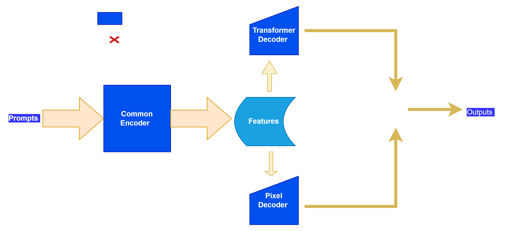

# Open-Vocab Segmentation Lab
**Multimodal, Promptable, Open-set, and Continual Segmentation in Medical Images**

Very first architecture(just imaginary!)

## **Motivation**
Segmentation models often fail in real-world scenarios where:
- New object categories appears (**open-set**)
- User guidance is provided through different prompts(promptable)
- Models needs to learn constinuously without forgetting the previous knowledge.

## Common Failures and Observations 
- **Query decoder's failures ?**
- **Pixel decoder's failures ?**

**Prompt Observations**
- **Text prompts** alone are sufficient?

**Continual Learning Observations**

**Open-set Observations**

**Paper review**

See [reference papers](reviewed_paper.md)