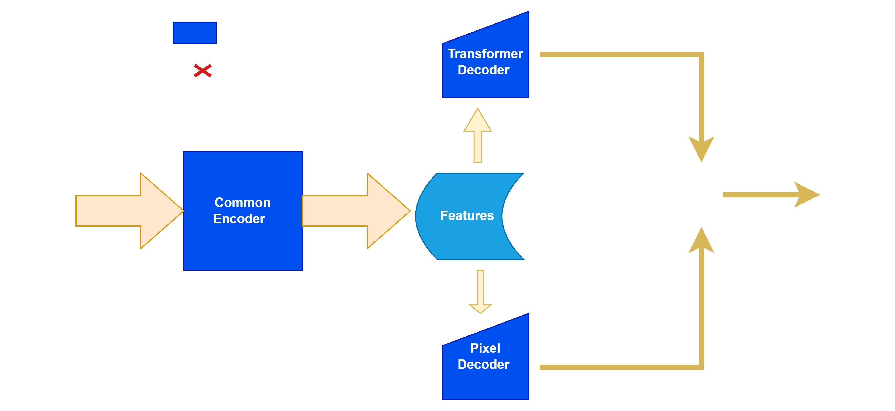

## 2025-12-28

**Paper:** Fang et al., *SEEM: Segment Everything Everywhere All at Once*, CVPR 2024  
**Link:** [https://arxiv.org](https://www.bing.com/ck/a?!&&p=fc53fa2e3f38439e3fbba1f575c15df248ac64aca8259b039a9c9e258a203343JmltdHM9MTc2Njc5MzYwMA&ptn=3&ver=2&hsh=4&fclid=3aac3e15-1859-61c2-1fb6-28541960605c&psq=SEEM%3a+Segment+Everything+Everywhere+All+at+Once&u=a1aHR0cHM6Ly9hcnhpdi5vcmcvYWJzLzIzMDQuMDY3MTg)  

**Key Insight:** Multimodal prompts improve open-vocabulary segmentation in incremental learning.  
**Relevance to Lab:** Suggests how to fuse text prompts with pixel/query decoders for continual learning.  
**Optional Notes:** Test T2 incremental phase with multimodal prompts.

